# Diagrama de flujo - Ciclo de mantenimiento de vehiculos

Modulo: **Barca Mantenimiento**  
Menu raiz: **Mantencion Barca**

Este diagrama resume el ciclo funcional completo: origenes de aviso, evaluacion, generacion de OT, ejecucion, revision, materiales, cierre y alertas documentales de flotilla.

## Flujo completo

```mermaid
flowchart TD
    A["Inicio en Mantencion Barca"] --> B["Calendario Mantenimiento"]
    A --> C["Origenes Avisos"]

    C --> PM["Planes de Mantenimiento"]
    C --> SOL["Solicitud de Mantencion"]
    C --> CHK["Checklist"]

    PM --> PM1["Configurar alcance: categoria y/o vehiculos"]
    PM1 --> PM2["Definir triggers: km, dias u horas"]
    PM2 --> PM3["Agregar actividades del plan"]
    PM3 --> PM4["Agregar materiales por actividad"]
    PM4 --> PM5{"Generacion de avisos"}
    PM5 -->|Boton Generar avisos| PM6["Evaluar vehiculos del plan"]
    PM5 -->|Cron PM| PM6
    PM6 --> PM7{"Se cumple algun trigger?"}
    PM7 -->|No| PM8["No genera aviso"]
    PM7 -->|Si| PM9{"Existe aviso PM abierto para el vehiculo?"}
    PM9 -->|Si| PM10["Omitir por duplicado"]
    PM9 -->|No| AV1["Crear Aviso origen PM"]
    PM10 --> PMEND["Fin evaluacion PM"]
    PM8 --> PMEND

    SOL --> SOL1["Usuario registra solicitud"]
    SOL1 --> SOL2["Fecha actual bloqueada"]
    SOL2 --> SOL3["Selecciona vehiculo"]
    SOL3 --> SOL4["Equipo de mantenimiento se carga automatico"]
    SOL4 --> SOL5["Completa prioridad, estado, ubicacion y descripcion"]
    SOL5 --> SOL6{"Accion sobre solicitud"}
    SOL6 -->|Cancelar| SOL7["Estado Cancelada"]
    SOL6 -->|Generar aviso Programador/Admin| AV2["Crear Aviso origen Solicitud"]
    SOL7 --> SOLEND["Fin solicitud"]

    CHK --> CHK1["Usuario registra checklist"]
    CHK1 --> CHK2["Selecciona tipo de vehiculo"]
    CHK2 --> CHK3["Sistema carga puntos desde catalogo"]
    CHK3 --> CHK4["Usuario responde Si/No"]
    CHK4 --> CHK5{"Guardar checklist"}
    CHK5 --> CHK6{"Existe al menos un No?"}
    CHK6 -->|No| CHK7["Queda Nuevo o Cerrado sin aviso si se ejecuta accion"]
    CHK6 -->|Si| AV3["Crear Aviso origen Checklist"]
    CHK7 --> CHKEND["Fin checklist sin aviso"]

    AV1 --> AV["Aviso de Mantencion - Estado Nuevo"]
    AV2 --> AV
    AV3 --> AV

    AV --> AVEVAL{"Decision del Programador/Admin"}
    AVEVAL -->|Rechazar| AVR["Estado Rechazado"]
    AVEVAL -->|Tomar para evaluacion| AVA["Estado En evaluacion"]

    AVA --> AVEDIT["Revisar datos del aviso"]
    AVEDIT --> AVDATE["Completar Fecha programada"]
    AVDATE --> AVACT["Revisar actividades y materiales"]
    AVACT --> AVOT{"Generar OT?"}
    AVOT -->|No| AVA
    AVOT -->|Si| AVREQ{"Tiene equipo y fecha programada?"}
    AVREQ -->|No| AVERR["Mostrar validacion: completar datos requeridos"]
    AVERR --> AVEDIT
    AVREQ -->|Si| OT1["Crear Orden de Trabajo"]

    OT1 --> OT2["Copiar descripcion del aviso"]
    OT2 --> OT3["Copiar fecha programada"]
    OT3 --> OT4["Copiar actividades del aviso"]
    OT4 --> OT5["Copiar materiales por actividad"]
    OT5 --> AVI["Aviso pasa a Con OT creada"]
    OT5 --> OT["OT Barca - Estado En ejecucion"]

    OT --> MAT0{"Hay materiales?"}
    MAT0 -->|No| ACT0["Ejecutar actividades"]
    MAT0 -->|Si| MAT1{"Reservar materiales?"}

    MAT1 -->|No| MAT5["Materiales sin reserva previa"]
    MAT1 -->|Si| MAT2["Crear picking interno de reserva"]
    MAT2 --> MAT3["Confirmar y asignar stock"]
    MAT3 --> MAT4{"Resultado reserva"}
    MAT4 -->|Todo reservado| MATS1["Estado Reservado"]
    MAT4 -->|Parcial| MATS2["Estado Reserva parcial"]
    MAT4 -->|Nada reservado| MATS3["Estado Sin stock suficiente"]
    MATS1 --> MAT5
    MATS2 --> MAT5
    MATS3 --> MAT5

    MAT5 --> MAT6{"Entregar materiales?"}
    MAT6 -->|No| ACT0
    MAT6 -->|Si| MAT7["Registrar cantidad retirada"]
    MAT7 --> MAT8["Si hay reserva usa reservado; si no usa estimado"]
    MAT8 --> ACT0

    ACT0 --> ACT1["Actividad Pendiente"]
    ACT1 -->|Boton Iniciar| ACT2["Actividad En ejecucion"]
    ACT2 --> ACT3["Completar descripcion de lo realizado"]
    ACT3 --> ACT4["Seleccionar resultado: Resuelto, Parcial o No resuelto"]
    ACT4 --> ACT5{"Boton Notificar"}
    ACT5 -->|Faltan datos| ACTERR["Validacion: completar descripcion y resultado"]
    ACTERR --> ACT3
    ACT5 -->|Datos completos| ACT6["Actividad Notificada"]
    ACT6 --> ACT7{"Cerrar linea?"}
    ACT7 -->|Si| ACT8["Actividad Cerrada"]
    ACT7 -->|No| ACTDONE["Actividad queda Notificada"]
    ACT8 --> ACTDONE

    ACTDONE --> OTREV0{"Todas las actividades notificadas o cerradas?"}
    OTREV0 -->|No| ACT1
    OTREV0 -->|Si| OTREV1["Boton Enviar a revision"]
    OTREV1 --> OTREV2["Sistema asigna revisor"]
    OTREV2 --> OTREV3["OT Etapa Reparado"]

    OTREV3 --> OTDES{"Decision Programador/Admin"}
    OTDES -->|Devolver a ejecucion| OTD1["Requiere motivo de devolucion"]
    OTD1 --> OTD2["Incrementa contador de devoluciones"]
    OTD2 --> OTD3["Notifica responsable"]
    OTD3 --> OT
    OTDES -->|Cierre Total| OTA1["OT Etapa Cierre Total"]
    OTDES -->|Cierre Parcial| OTA1B["OT Etapa Cierre Parcial"]
    OTA1 --> OTA2["Notifica responsable"]
    OTA1B --> OTA2

    OTA2 --> MATC0{"Materiales entregados?"}
    MATC0 -->|No| OTCLOSESTD["Cerrar/terminar etapa estandar de OT si corresponde"]
    MATC0 -->|Si| MATC1["Registrar cantidad consumida por material"]
    MATC1 --> MATC2{"Cerrar materiales"}
    MATC2 -->|Consumo mayor que retirado| MATCERR["Validacion: corregir consumo"]
    MATCERR --> MATC1
    MATC2 -->|Valido| MATC3["Calcular devuelto = retirado - consumido"]
    MATC3 --> MATC4["Calcular costo estimado y real"]
    MATC4 --> OTCLOSESTD

    OTCLOSESTD --> AVCLOSE0["Volver al Aviso asociado"]
    AVCLOSE0 --> AVCLOSE1{"OT esta en etapa terminada?"}
    AVCLOSE1 -->|No| AVCLOSEERR["No permite cerrar aviso"]
    AVCLOSEERR --> OTCLOSESTD
    AVCLOSE1 -->|Si| AVCLOSE2["Boton Cerrar aviso"]
    AVCLOSE2 --> AVCLOSE3["Aviso Estado Cerrado"]
    AVCLOSE3 --> AVCLOSE4{"Aviso origen PM?"}
    AVCLOSE4 -->|No| FIN["Fin del ciclo"]
    AVCLOSE4 -->|Si| AVCLOSE5["Actualizar medidores del vehiculo sin retroceder valores"]
    AVCLOSE5 --> FIN

    subgraph FLOT["Flotilla - alertas documentales"]
        F1["Vehiculo de Flotilla"] --> F2{"Evento"}
        F2 -->|Cambian Tarjeta combustible o TAG| F3["Buscar regla Modificaciones"]
        F3 --> F4{"Hay destinatarios?"}
        F4 -->|No| F5["No envia correo"]
        F4 -->|Si| F6["Enviar correo de modificaciones"]
        F2 -->|Boton Enviar Avisos o cron| F7["Revisar vencimientos de todos los vehiculos"]
        F7 --> F8["Licencia, permiso circulacion, revision tecnica"]
        F8 --> F9{"Vencen dentro de dias alerta?"}
        F9 -->|No| F10["No envia correo"]
        F9 -->|Si| F11["Buscar regla Vencimientos"]
        F11 --> F12{"Hay destinatarios?"}
        F12 -->|No| F10
        F12 -->|Si| F13["Enviar correo de vencimientos"]
    end
```

## Lectura rapida por tramo

| Tramo | Documento | Estado inicial | Estado final esperado |
|---|---|---|---|
| Plan PM | Planes de Mantenimiento | Plan activo | Aviso PM nuevo o sin aviso por no cumplir trigger/duplicado |
| Solicitud | Solicitud de Mantencion | Nueva | Aviso creado o Cancelada |
| Checklist | Checklist | Nuevo | Aviso generado, Cerrado sin aviso o Cancelado |
| Aviso | Avisos | Nuevo | Con OT creada, Rechazado o Cerrado |
| OT | Orden de Trabajo | En progreso | Cierre Total o Cierre Parcial |
| Actividad OT | Actividades de OT | Pendiente | Notificada o Cerrada |
| Materiales | Materiales de OT | Pendiente reserva | Reservado/parcial/sin stock, entregado y cerrado |
| Flotilla | Vehiculo | Cambio documental o revision programada | Correo enviado o sin envio por falta de vencimientos/destinatarios |

## Puntos de control operativos

- Un vehiculo no debe tener mas de un aviso PM abierto.
- La OT solo se genera desde un aviso en **En evaluacion**.
- La **Fecha programada** del aviso es obligatoria para generar OT.
- Todas las actividades deben estar **Notificadas** o **Cerradas** antes de enviar la OT a revision.
- La devolucion de OT a ejecucion requiere motivo.
- El cierre de materiales requiere entrega previa y consumo menor o igual a cantidad retirada.
- El aviso solo cierra cuando la OT asociada esta en una etapa estandar terminada.
- Al cerrar aviso PM, los medidores del vehiculo se actualizan sin retroceder valores.
