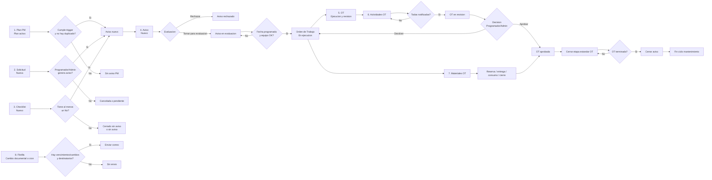
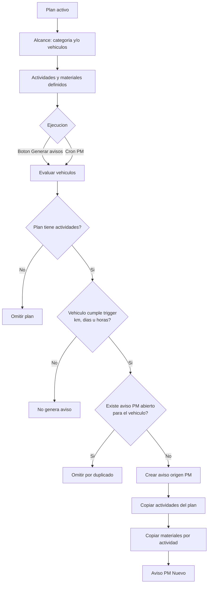
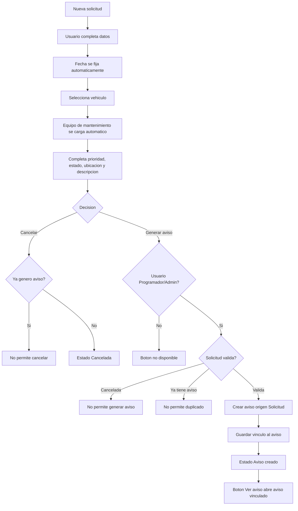
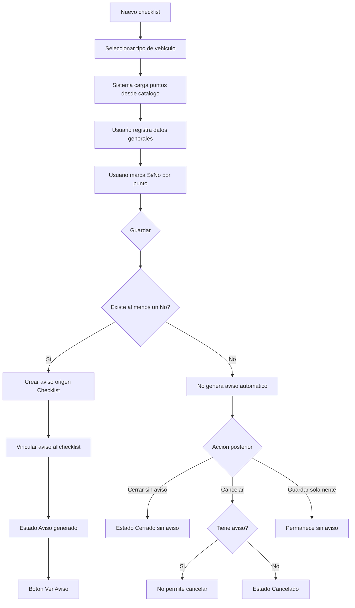
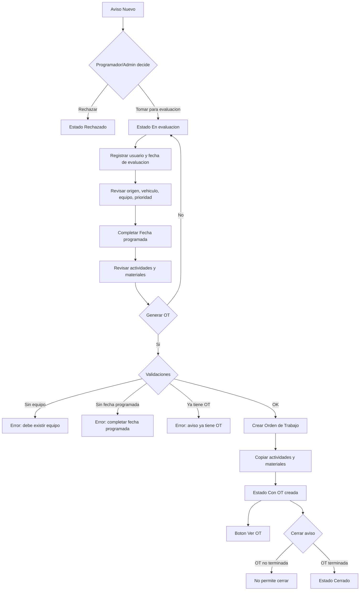
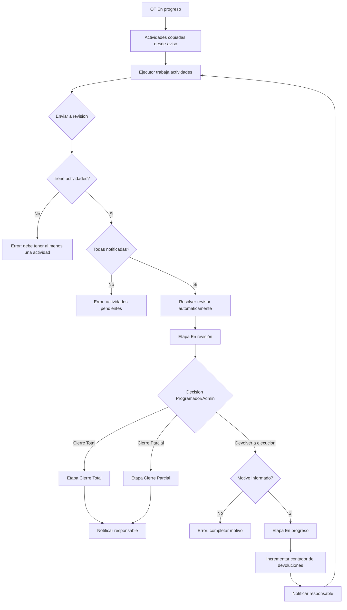
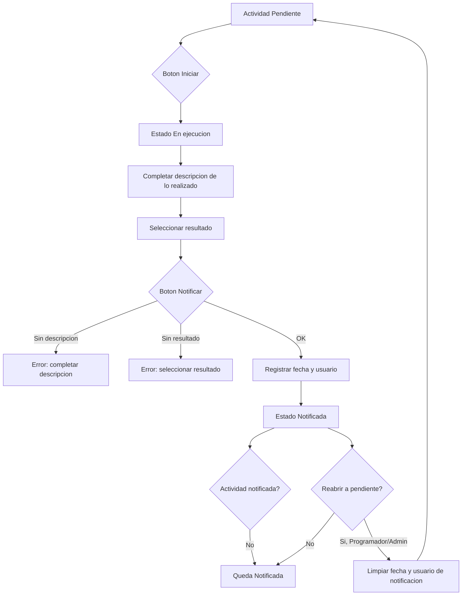
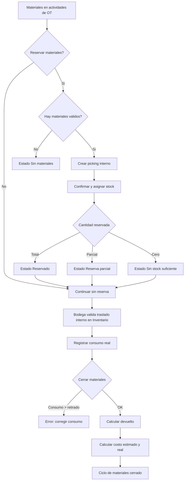
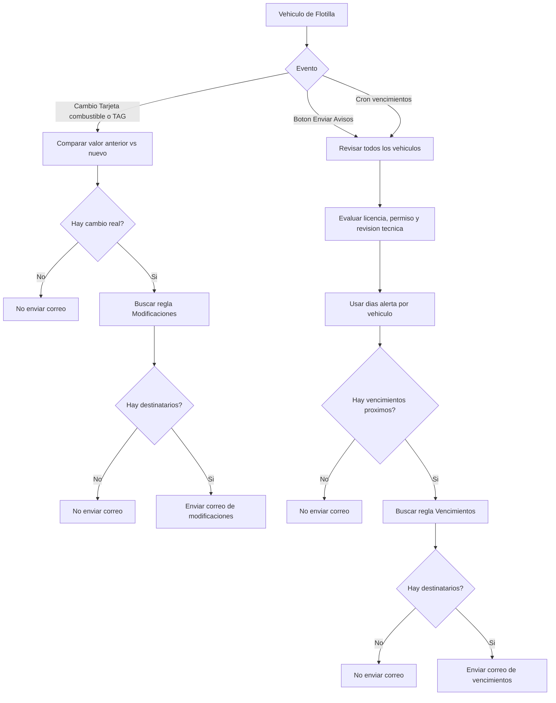

# Diagramas macro por tramo - Ciclo de mantenimiento

Modulo: **Barca Mantenimiento**  
Base funcional: 8 tramos del ciclo operativo de mantenimiento.

## 1. Diagrama macro

## 2. Tramo 1 - Plan PM

Documento: **Planes de Mantenimiento**  
Estado inicial: **Plan activo**  
Estado final esperado: **Aviso PM nuevo** o **sin aviso por no cumplir trigger/duplicado**

## 3. Tramo 2 - Solicitud de Mantencion

Documento: **Solicitud de Mantencion**  
Estado inicial: **Nueva**  
Estado final esperado: **Aviso creado** o **Cancelada**

## 4. Tramo 3 - Checklist

Documento: **Checklist**  
Estado inicial: **Nuevo**  
Estado final esperado: **Aviso generado**, **Cerrado sin aviso** o **Cancelado**

## 5. Tramo 4 - Aviso

Documento: **Avisos**  
Estado inicial: **Nuevo**  
Estado final esperado: **Con OT creada**, **Rechazado** o **Cerrado**

## 6. Tramo 5 - Orden de Trabajo

Documento: **Orden de Trabajo**  
Estado inicial: **En progreso**  
Estado final esperado: **Cierre Total** o **Cierre Parcial**

## 7. Tramo 6 - Actividades de OT

Documento: **Actividades de OT**  
Estado inicial: **Pendiente**  
Estado final esperado: **Notificada**

## 8. Tramo 7 - Materiales de OT

Documento: **Materiales de OT**  
Estado inicial: **Pendiente reserva**  
Estado final esperado: **Reservado/parcial/sin stock, entregado y cerrado**

## 9. Tramo 8 - Flotilla

Documento: **Vehiculo / Flotilla**  
Estado inicial: **Cambio documental o revision programada**  
Estado final esperado: **Correo enviado** o **sin envio por falta de vencimientos/destinatarios**

